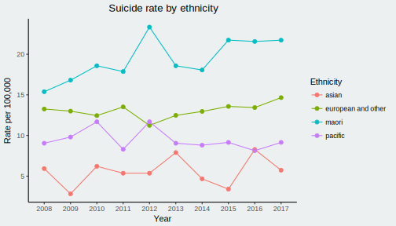

In some of my work for an NGO I ran in to trouble getting easily interpretable suicide statistics. A rough interactive app I have developed should help overcome this, [check it out here](https://shiny.nzoss.org.nz/suicide_statistics/) and read on if you want to know a little more.

### Background

Currently the most detailed suicide statistics are released by the chief coroner on the [Ministry of Justice website](https://coronialservices.justice.govt.nz/suicide/annual-suicide-statistics-since-2011/). However they are presented in tables as PDF reports. It can also be a pain to compare variables such as age as a report will only contain a single year of data.

Using the `tabulizer` package I was able to pull together most of the data into a clean long-format dataframe. I then put together [an app](https://shiny.nzoss.org.nz/suicide_statistics/) using `shiny` to present the data in interactive graphs. 

### The details

Pulling some of data across years of reports proved to be a challenge. The names of the PDFs and the order of tables randomly changed which meant the inputs to the `tabulizer` function also needed to change. Obviously this is the fault of the website maintainers not the package, the package itself is very easy to use. Parse a URL to the PDF and the page your table is on, e.g. `tabulizer("http://website/yourfile.pdf", pages = 6)`. It does take some tidying up but nothing a couple of `tidyverse` functions can't handle. Check the [GitHub repo](https://github.com/haututu/suicideRates) for the details on that.

Once we grab the data and stitch it together, we can really start slicing and dicing the data across years. Such as the ethnicity data below.

Despite rates jumping around **a lot** for things like age or regionally. We can see very clearly that Māori have a very high suicide rate whereas asians have the lowest. Interestingly the Pacific population looks quite a bit lower than Māori. Intuitively I would have thought that suicide has a strong influence from socio-economic status that, I assume, is near the same for Māori and Pacific people.

### Conclusion

In short, the `tabulizer` function is a great way to pull data from online or from local PDFs. You can throw together a couple helper functions to iterate over URLs to get multiple years of reports. Once you have cleaned the data up its trivial to put it together in an interactive app. Applying this to the suicide data we are able to make it far more accessible and make comparisons that were not achievable in the reports alone.